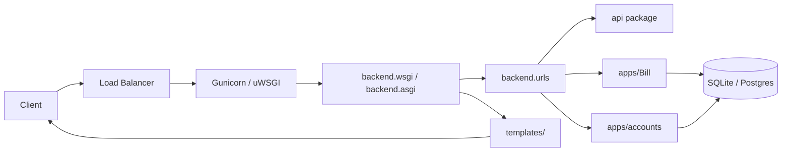

# Bills24 — Architecture Overview

This document describes the high-level architecture of the Bills24 Django project, component responsibilities, data flows, deployment notes, and recommended improvements.

## Summary
- Type: Monolithic Django web application.
- Primary apps: `accounts`, `Bill` (under `apps/`).
- API surface: Project-level `api/` package and app-level `api/` modules.
- Deployment targets: WSGI/ASGI (`backend/wsgi.py`, `backend/asgi.py`) with a `Procfile` present for PaaS deployments.
- Database: SQLite (`db.sqlite3`) in development; production should use PostgreSQL or other server.

## Components

- Project root: Django `manage.py`, global `api/`, `backend/`, and `settings/` split into `development.py` and `production.py`.
- `apps/accounts`: authentication, user models, forms, and app-level API endpoints.
- `apps/Bill`: domain models for bills, app API client/helpers, serializers, and views.
- `api/`: shared API utilities, request/response helpers and top-level endpoints.
- `backend/`: entry points (`wsgi.py`, `asgi.py`), middleware and global URL routing.
- `templates/` and `public/`: server-side HTML templates, email templates, and public assets.

## Data Flow (Typical Request)

1. Client (browser or mobile) sends HTTP request.
2. Web server (Gunicorn/uwsgi) routes to `backend/wsgi.py` or ASGI server routes to `backend/asgi.py`.
3. Django URL dispatcher (root `backend/urls.py`) maps route to view in `api/` or an app (e.g., `apps/Bill`).
4. View uses serializers (app `api/serializers.py`) and services (app-level utils) to validate and persist data in DB.
5. Email generation uses `templates/emails/*` and `api/response.py` to build responses.

## Component Diagram (mermaid)

## Deployment

- Development: `sqlite3`, `manage.py runserver`.
- Production: use `Procfile` to run Gunicorn (or similar). Replace SQLite with PostgreSQL, configure `ALLOWED_HOSTS`, static file serving (e.g., WhiteNoise or CDN), and secrets via environment variables.

## Configuration & Secrets

- `settings/production.py` should read secrets from env vars (DATABASE_URL, SECRET_KEY, EMAIL creds, etc.).
- Keep sensitive values out of repo and out of `settings/development.py`.

## Testing & CI

- Tests are located in app `tests.py` files. Add a CI pipeline (GitHub Actions) to run `pytest` or `python manage.py test` on push.

## Observability

- Add structured logging, Sentry (or equivalent) for error tracking, and request metrics (Prometheus/Grafana or cloud provider metrics).

## Security Considerations

- Use HTTPS in production and set `SECURE_COOKIE`/`HSTS` headers.
- Validate and sanitize any third-party input (forms, API clients in `apps/Bill/api/client.py`).
- Ensure `CSRF` protection for forms and endpoints that use session auth.

## Recommendations (short-term)

1. Replace SQLite with PostgreSQL for production and add migrations management in CI.
2. Add a `README-ARCHITECTURE.md` or keep this file under `docs/` if project grows.
3. Add automated tests for critical flows (auth, billing, email sending). Use mocks for external API calls.
4. Add a `docker-compose` for local parity with production DB and services.

## Recommended File Map (quick reference)

- `manage.py` — CLI entry.
- `backend/` — WSGI/ASGI + global routing and middleware.
- `apps/accounts/` — auth.
- `apps/Bill/` — billing domain.
- `api/` — shared API helpers.
- `templates/emails/` — transactional email templates.

---

If you'd like, I can:

- Move this file into `docs/` and link it in `README.md`.
- Generate a `docker-compose.yml` and a minimal `Dockerfile` for production parity.
- Produce a sequence diagram for a specific flow (signup, create bill, email).

Created: ARCHITECTURE.md
